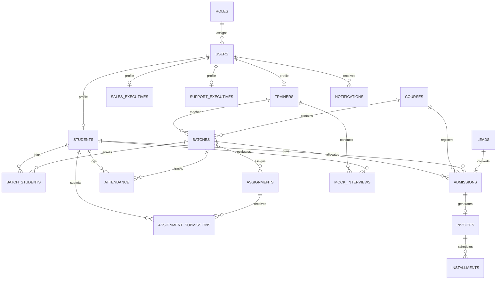

# CampusFlow – Training & Admission Management Portal
## Final Year Computer Science & Engineering Project Report

---

### Executive Summary
**CampusFlow** is an enterprise-grade, web-based Training & Admission Management Portal built to digitize and automate the entire student lifecycle within educational institutes and EdTech academies. From initial lead acquisition and inquiry response to admission confirmation, batch allocation, daily attendance tracking, practical assignment submission & evaluation, 1-on-1 mock technical interviews, fee installment financing, notifications, and executive analytics reports.

---

### 1. Technology Stack Specification

| Component | Technology | Version / Configuration |
| :--- | :--- | :--- |
| **Backend Runtime** | Node.js | v20+ / Express.js Framework |
| **Database Engine** | MySQL Server | v8.0+ running on **PORT 3307** (`campusflow_db`) |
| **Frontend Framework** | React.js | v18+ initialized with Vite |
| **UI Design & Styling** | Bootstrap 5 + Custom CSS | Glassmorphic theme, responsive layout, dark mode |
| **Security & Auth** | JWT + bcryptjs | Role-Based Access Control (RBAC) middleware |
| **HTTP Client** | Axios | Configured with Bearer token interceptors |

---

### 2. System Architecture & ER Diagram



---

### 3. Role-Based Access Control (RBAC) Matrix

CampusFlow enforces server-side and client-side permissions across 6 user roles:

| Module / Action | Super Admin | Admin | Sales Exec | Trainer | Support Exec | Student |
| :--- | :---: | :---: | :---: | :---: | :---: | :---: |
| **System User Administration** | ✅ | ✅ | ❌ | ❌ | ❌ | ❌ |
| **Pending Student Approvals** | ✅ | ✅ | ❌ | ❌ | ❌ | ❌ |
| **Course & Batch Creation** | ✅ | ✅ | ❌ | ❌ | ❌ | ❌ |
| **Lead & Inquiry Management** | ✅ | ✅ | ✅ | ❌ | ✅ | ❌ |
| **Admission Confirmation** | ✅ | ✅ | ✅ | ❌ | ❌ | ❌ |
| **Daily Attendance Marking** | ✅ | ✅ | ❌ | ✅ | ❌ | 👁️ (View Only) |
| **Assignment Publishing** | ✅ | ✅ | ❌ | ✅ | ❌ | 👁️ (View Only) |
| **Assignment Submission** | ❌ | ❌ | ❌ | ❌ | ❌ | ✅ |
| **Mock Interview Scheduling** | ✅ | ✅ | ❌ | ✅ | ❌ | 👁️ (Scorecard) |
| **Fee Invoice Payment Log** | ✅ | ✅ | ❌ | ❌ | ❌ | ✅ |
| **Executive Reports** | ✅ | ✅ | ❌ | ❌ | ❌ | ❌ |

---

### 4. Database Schema Specification (21 Normalized Tables)

1. **`roles`**: `id`, `name`, `description`, `timestamps`
2. **`users`**: `id`, `role_id`, `full_name`, `email`, `password_hash`, `phone`, `status` (`PENDING`, `ACTIVE`, `INACTIVE`), `timestamps`
3. **`students`**: `id`, `user_id`, `roll_number`, `dob`, `gender`, `address`, `qualification`, `guardian_name`, `guardian_phone`, `timestamps`
4. **`trainers`**: `id`, `user_id`, `employee_id`, `specialization`, `qualification`, `experience_years`, `bio`, `timestamps`
5. **`sales_executives`**: `id`, `user_id`, `employee_id`, `target_conversions`, `timestamps`
6. **`support_executives`**: `id`, `user_id`, `employee_id`, `department`, `timestamps`
7. **`courses`**: `id`, `code`, `name`, `description`, `duration_weeks`, `fee_amount`, `status`, `timestamps`
8. **`batches`**: `id`, `course_id`, `trainer_id`, `batch_code`, `name`, `start_date`, `end_date`, `timing`, `room_number`, `max_students`, `status`, `timestamps`
9. **`batch_students`**: `id`, `batch_id`, `student_id`, `enrolled_at`, `status`, `timestamps`
10. **`leads`**: `id`, `sales_exec_id`, `candidate_name`, `email`, `phone`, `course_id`, `lead_source`, `status`, `notes`, `timestamps`
11. **`inquiries`**: `id`, `lead_id`, `student_id`, `inquiry_date`, `query`, `response`, `status`, `timestamps`
12. **`admissions`**: `id`, `lead_id`, `student_id`, `course_id`, `batch_id`, `admission_date`, `total_fee`, `discount_amount`, `final_fee`, `status`, `timestamps`
13. **`attendance`**: `id`, `batch_id`, `student_id`, `date`, `status`, `marked_by`, `remarks`, `timestamps`
14. **`assignments`**: `id`, `batch_id`, `trainer_id`, `title`, `description`, `deadline`, `max_marks`, `file_url`, `timestamps`
15. **`assignment_submissions`**: `id`, `assignment_id`, `student_id`, `submission_date`, `submission_text`, `file_url`, `marks_obtained`, `feedback`, `status`, `evaluated_by`, `timestamps`
16. **`mock_interviews`**: `id`, `student_id`, `trainer_id`, `batch_id`, `scheduled_date`, `topic`, `score`, `status`, `feedback`, `key_strengths`, `areas_for_improvement`, `timestamps`
17. **`invoices`**: `id`, `admission_id`, `student_id`, `invoice_number`, `total_amount`, `paid_amount`, `due_amount`, `status`, `due_date`, `timestamps`
18. **`installments`**: `id`, `invoice_id`, `installment_number`, `amount`, `due_date`, `paid_date`, `payment_mode`, `transaction_id`, `status`, `remarks`, `timestamps`
19. **`coupons`**: `id`, `code`, `discount_type`, `discount_value`, `valid_until`, `max_uses`, `current_uses`, `is_active`, `timestamps`
20. **`notifications`**: `id`, `user_id`, `title`, `message`, `type`, `is_read`, `timestamps`
21. **`audit_logs`**: `id`, `user_id`, `action`, `entity_type`, `entity_id`, `ip_address`, `details`, `timestamps`

---

### 5. Standardized REST API Endpoints

- **Authentication**: `POST /api/auth/login`, `POST /api/auth/logout`, `POST /api/auth/forgot-password`, `POST /api/auth/register-student`, `GET /api/auth/me`, `PUT /api/auth/change-password`
- **Users**: `GET /api/users`, `POST /api/users`, `GET /api/users/pending-approvals`, `PUT /api/users/:id/approve`, `PUT /api/users/:id/reject`, `PATCH /api/users/:id/status`
- **Students & Trainers**: `GET /api/users/students`, `GET /api/users/trainers`
- **Courses**: `GET /api/courses`, `POST /api/courses`, `PUT /api/courses/:id`, `DELETE /api/courses/:id`
- **Batches**: `GET /api/batches`, `POST /api/batches`, `PUT /api/batches/:id`, `POST /api/batches/:id/students`
- **Leads & Inquiries**: `GET /api/leads`, `POST /api/leads`, `PUT /api/leads/:id`, `GET /api/leads/inquiries`, `POST /api/leads/inquiries`, `PUT /api/leads/inquiries/:id`
- **Admissions**: `GET /api/admissions`, `POST /api/admissions`, `POST /api/admissions/register`
- **Attendance**: `GET /api/attendance/batch`, `POST /api/attendance/mark`, `GET /api/attendance/student/:id?`
- **Assignments**: `GET /api/assignments`, `POST /api/assignments`, `POST /api/assignments/submit`, `PUT /api/assignments/evaluate/:id`
- **Finance**: `GET /api/finance/invoices`, `POST /api/finance/installments/:id/pay`
- **Mock Interviews**: `GET /api/mock-interviews`, `POST /api/mock-interviews/schedule`, `PUT /api/mock-interviews/:id/evaluate`
- **Reports & Notifications**: `GET /api/notifications`, `PUT /api/notifications/:id/read`, `GET /api/reports/dashboard-stats`, `GET /api/reports/analytics`

---

### 6. Installation & Deployment Guide

```bash
# 1. Database Setup (MySQL Port 3307)
cd backend
npm run init-db

# 2. Start Express API Server (Port 5000)
cd backend
npm run dev

# 3. Start Vite React App (Port 5173)
cd frontend
npm run dev
```

---
*Report Generated for Final Year Project Evaluation.*
